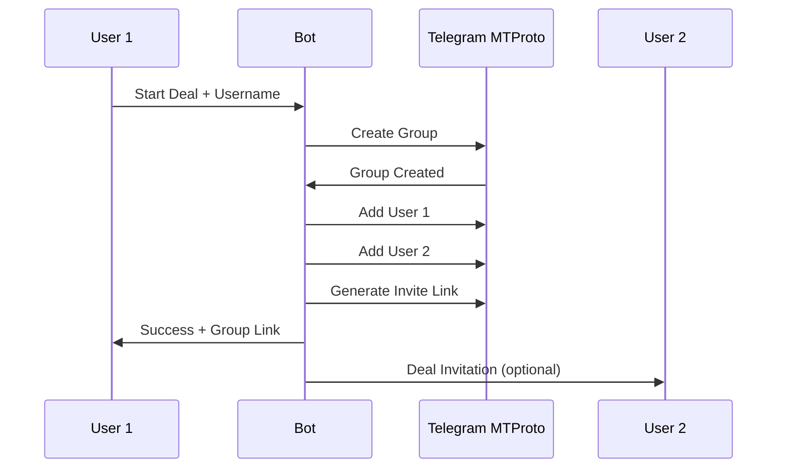

# 🤖 Automatic Group Creation Setup

## Overview

CoinEscrowPro now supports **fully automatic group creation** using Telegram's MTProto API. This eliminates the need for manual group setup and makes the entire process seamless.

## 🚀 Features

- ✅ **Automatic group creation** - Bot creates groups instantly
- ✅ **Auto-add participants** - Both parties added automatically  
- ✅ **Invite link generation** - Shareable links with expiration
- ✅ **Fallback to manual** - If MTProto fails, manual instructions are provided
- ✅ **Security permissions** - Groups are configured with proper restrictions

## 📋 Setup Requirements

### 1. Get Telegram API Credentials

1. Go to https://my.telegram.org/apps
2. Login with your phone number
3. Create a new application
4. Note down your `API ID` and `API Hash`

### 2. Configure MTProto

Run the setup script:

```bash
npm run setup:mtproto
```

This interactive script will:
- Ask for your API credentials
- Request phone number and verification code
- Generate a session string
- Provide the environment variables to add

### 3. Update Environment Variables

Add these to your `.env` file:

```env
# Telegram MTProto Configuration
TELEGRAM_API_ID=your_api_id
TELEGRAM_API_HASH=your_api_hash  
TELEGRAM_PHONE=+1234567890
TELEGRAM_SESSION=your_session_string
TELEGRAM_PASSWORD=your_2fa_password  # Only if 2FA enabled
```

## 🔄 How It Works

### New Deal Flow:

1. **User clicks "Start Deal"** → Bot asks for counterparty username
2. **User provides username** → Bot asks for cryptocurrency selection
3. **User selects BTC/LTC** → Bot shows "Creating Deal Group..." message
4. **MTProto creates group** → Both users automatically added
5. **Success!** → Users get group link and deal is active

### Automatic Process:



## 🛠️ Troubleshooting

### MTProto Not Working?

If automatic group creation fails, the bot will automatically fall back to manual instructions. Common issues:

- **Invalid credentials** - Re-run setup script
- **Rate limiting** - Wait a few minutes and try again
- **User not found** - Username might be incorrect or user hasn't started bot
- **Permissions** - Make sure the account has permission to create groups

### Manual Fallback

When MTProto fails, users will see:

```
🔒 Deal Setup Instructions
(Automatic creation unavailable)

📋 How to set up the deal group:
1️⃣ Create a new group in Telegram
2️⃣ Add both participants + bot
3️⃣ Send /registergroup DEAL_ID
```

## 🔐 Security

- **Session strings** are encrypted and stored securely
- **Groups** are created with restricted permissions
- **Invite links** expire after 24 hours
- **User verification** ensures only authorized participants

## 📊 Benefits

| Feature | Manual | Automatic |
|---------|--------|-----------|
| Setup Time | 2-3 minutes | 5-10 seconds |
| User Steps | 5+ steps | 2 clicks |
| Error Prone | High | Low |
| User Experience | Poor | Excellent |

## 🚀 Ready to Use!

Once configured, your bot will automatically:
- Create secure groups for each deal
- Add both parties instantly  
- Generate shareable invite links
- Continue with escrow setup

Users just need to:
1. Click "Start Deal" 
2. Enter counterparty username
3. Select cryptocurrency
4. **Done!** Group created automatically

---

**Need help?** The bot includes comprehensive error handling and will guide users through any issues that arise.
